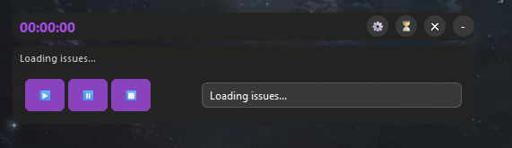

<div align="center" id="top"> 
  <div align="center" id="top"> 
    
  </div>

  &#xa0;

</div>

<h1 align="center">Zilean</h1>

<p align="center">
  

  

  

  
</p>


<p align="center">
  <a href="#dart-sobre">Sobre</a> &#xa0; | &#xa0; 
  <a href="#sparkles-funcionalidades">Funcionalidades</a> &#xa0; | &#xa0;
  <a href="#rocket-tecnologias">Tecnologias</a> &#xa0; | &#xa0;
  <a href="#white_check_mark-pré-requisitos">Pré requisitos</a> &#xa0; | &#xa0;
  <a href="#checkered_flag-começando">Começando</a> &#xa0; | &#xa0;
  <a href="#memo-licença">Licença</a> &#xa0; | &#xa0;
  <a href="https://github.com/gustaoliv/" target="_blank">Autor</a>
</p>

<br>

## :dart: Sobre ##

Projeto utilizado para controle de tempo gasto em Cards/Issues no Jira.
Particularmente eu sempre tive dificuldade em ficar registrando o tempo gasto nas minhas tarefas, e por isso, desenvolvi esse crônometro que registra automaticamente os tempos nos cards para me ajudar.\
Um widget flutuante elegante e moderno para rastrear o tempo em problemas do Jira. Projetado para ser sempre visível, minimalista e compatível com o Windows.

Versão Minimizada:\


Versão Maximizada:\


## :sparkles: Funcionalidades ##

:heavy_check_mark: Registro de tempo gasto em um Card/Issue;\
:heavy_check_mark:Widget flutuante: widget sempre visível e arrastável que permanece visível enquanto você trabalha;\
:heavy_check_mark: Interface recolhível: alterne entre a visualização mínima do temporizador e o painel de controle completo\
:heavy_check_mark: Integração com o Jira: integração perfeita com o Jira para busca de cartões e registro de tempo\
:heavy_check_mark: Bandeja do sistema: Minimize a bandeja do sistema para invisibilidade completa quando necessário\
:heavy_check_mark: Configuração de salvamento automático: lembra suas configurações e a posição da janela\

## :rocket: Tecnologias ##

As seguintes ferramentas foram usadas na construção do projeto:

- [Python](https://www.python.org/)


## :white_check_mark: Pré requisitos ##

Antes de começar :checkered_flag:, você precisa ter o [Git](https://git-scm.com) e o [Python](https://www.python.org/) instalados em sua maquina.

## :checkered_flag: Começando ##

```bash
# Clone este repositório
$ git clone https://github.com/gustaoliv/zilean

# Entre na pasta
$ cd zilean

# Crie a sua virtualenv
$ python -m venv .venv

# Acesso a sua virtualenv
$ ./.venv/Scripts/activate

# Instale as dependências
$ pip install -r ./requirements.txt

# Para iniciar o projeto
$ python app.py

# O app vai inicializar na sua máquina
```

## :memo: Licença ##

Este projeto está sob licença MIT. Veja o arquivo [LICENSE](LICENSE.md) para mais detalhes.


Feito com :heart: por <a href="https://github.com/gustaoliv/" target="_blank">gustaoliv/</a>

&#xa0;

<a href="#top">Voltar para o topo</a>